# Enron Fraud Project

This repository contains my code where I attempted to build a classifier to identify Enron Employees who may have committed fraud based on the public Enron financial and email dataset.

## Background
In 2000, Enron was one of the largest companies in the United States. By 2002, it had collapsed into bankruptcy due to widespread corporate fraud. In the resulting Federal investigation, there was a significant amount of typically confidential information entered into public record, including tens of thousands of emails and detailed financial data for top executives. 

This project involves building a person of interest identifier based on financial and email data made public as a result of the Enron scandal. 

The training and test data were made available by instructors of the Udacity Machine Learning course (UD120) and includes (1) Financial and email data of Enron employees (2) List of persons of interest in the fraud case, including individuals who were indicted, reached a settlement, or plea deal with the government, or testified in exchange for prosecution immunity.

## Workflow
Data wrangling involves the following
1. Data exploration and outliers removal
2. Feature engineering, Feature Selection and Feature Scaling
3. Quantify class proportions
4. Algorithm Selection with nested, stratified cross validation
5. Model Selection (Fine-tuning hyperparameters)
6. More performance evaluation (ROC and Precision-Recall Curves)

### (1) Data exploration and outliers removal
The original dataset includes financial data organized in 21 features of 146 Enron employees. 1 outlier named 'TOTAL' was removed from the dataset and 2 employees were removed as all the features were either NaN or 0. 

### (2) Feature engineering, Feature Selection and Feature Scaling
2 new features named 'normalized_from_poi_to_this_person' and 'normalized_from_this_person_to_poi' were created by normalizing the features 'from_poi_to_this_person' and 'from_this_person_to_poi' by 'to_messages' and 'from_messages' respectively. These new features replaced the following features: 'from_poi_to_this_person' and 'from_this_person_to_poi'. 

Feature selection was first performed by performing AB testing (Kruskal wallis with Bonferonni correction) between POI and not POI to select features that show promise to help discrimination between POI and not POI. Features with p-values < 0.15 were selected. Features with p-values > 0.15 include features that are dominated by missing values and NaNs.

The feature 'shared_receipt_with_poi' was removed as it was created by the instructor based on knowledge of the label and therefore contains information about the labels. 

The features 'total_payments' was also removed as it is redundant and is an aggregate of other features including 'salary' , 'bonus' , 'expenses' , 'other' and 'deferred_income'. 

At this point, 143 labels and 9 features remain. The features include: 'salary', 'bonus', 'deferred_income', total_stock_value', 'expenses', 'other', 'restricted_stock', 'normalized_from_poi_to_this_person', 'normalized_from_this_person_to_poi'.

Feature scaling was performed before algorithm selection. 

#### (3) Quantify class proportions

There are 18 persons of interest (POI) and 125 non-POIs in the cleaned-up dataset. Therefore, this dataset has unequal/severely skewed class proportions. 

### (4) Algorithm Selection with nested, stratified cross validation

Nested cross validation was used with grid search to select among the following 6 algorithms: 

1. Logistic Regression
2. Random Forest
3. SVM
4. KNN
5. Adaboost
6. Gradient boosting

GridSearch was used to iterate through range of parameters for PCA and for each classifier. Algorithm was tested with and without PCA (using all components without dimensional reduction).

Stratified cross validation was used to preserve the class proportion in each strata of the training dataset. 

2 strategies to deal with class imbalance were employed and compared:

1. Assign a larger penalty to wrong predictions on the minority class during model fitting using scikit-learn class_weight parameter = 'balanced' (Logistic regression, Random Forest, SVM, Adaboost)
2. [Upsample](https://www.kdnuggets.com/2019/05/fix-unbalanced-dataset.html) the minority class using scikit-learn's resample function (All 6 algorithms)

The performance of the models were assessed by F1 score, precision and recall. The accuracy scoring metric is also computed but not used for decision making as it is not a good metric to assess performance with a class-imbalanced dataset. 

**These are the F1, precision, recall and accuracy scores for all 6 algorithms without correcting for class imbalance:**

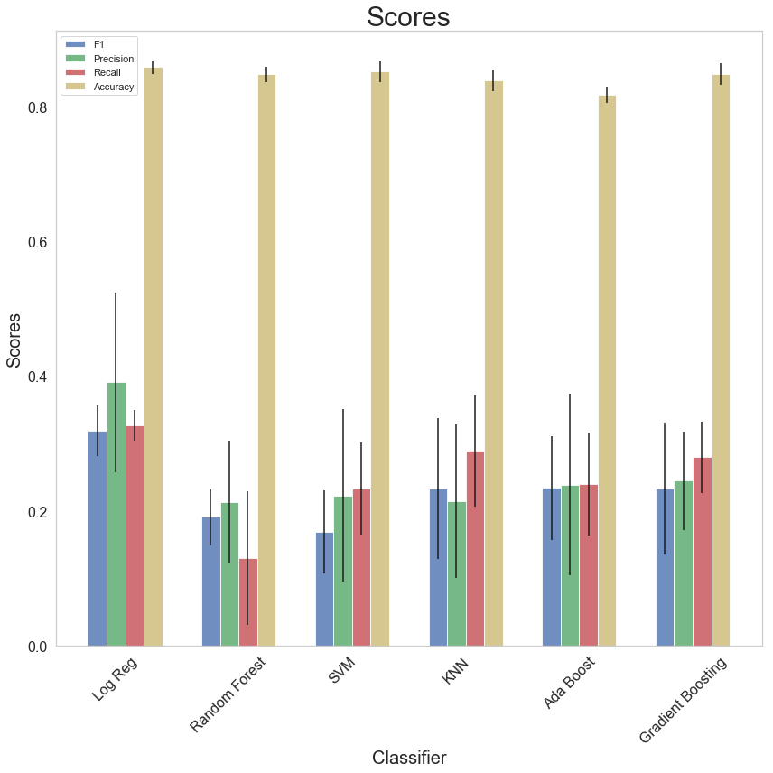

**These are the F1, precision, recall and accuracy scores for all 4 algorithms using balanced class weights in the classifier:**

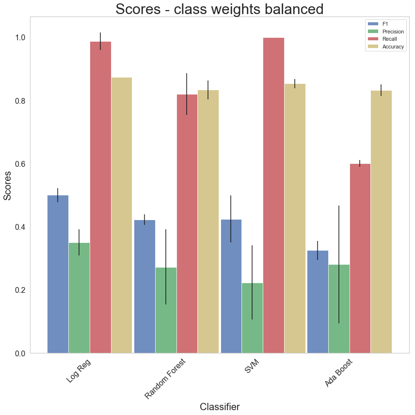

**These are the F1, precision, recall and accuracy scores for all 4 algorithms trained using a balanced dataset generated by upsampling the minority class:**

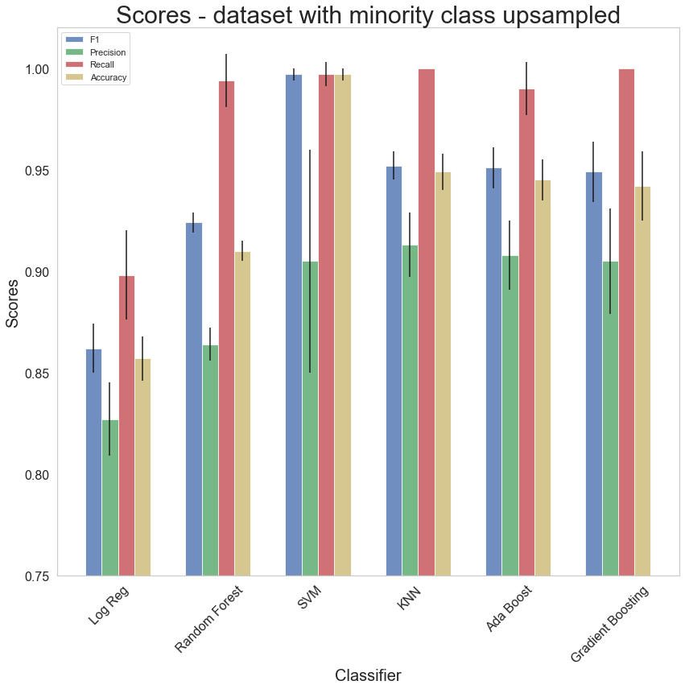

It is clear that both strategies to deal with class imbalance improve the performance evaluation scores. Training the classifier with a balanced dataset generated from upsampling the minority class is a clear winner but this method should be used with caution. [Read here for more discussion on this](https://towardsdatascience.com/handling-imbalanced-datasets-in-machine-learning-7a0e84220f28)

When class imbalance is corrected with scikit-learn's class weight = 'balanced' parameter, Logistic Regression performs the best as it has the highest mean score for F1 and Precision and reasonably high recall scores.

When class imbalance is corrected with upsampling minority class, SVM performs the best as it has the highest mean score for F1 and reasonably high precision and recall scores.

### (5) Model Selection (Fine-tuning hyperparameters)

Both logistic regression with balanced class weight and SVM with upsampled minority class were chosen for further hyperparameters fine-tuning. Scikit-learn's GridSearchCV was used to iterate through and compare the scores of each set of hyperparameters. 100 iterations/random splits of stratified k-fold cross-validation was employed to evaluate model performance and the set of hyperparameters that gave the best score in each iteration was saved. The set of hyperparameters that appeared most frequently across the 100 iterations were chosen as the hyperparameters of the final model. 

**1. Logistic regression trained with balanced class weight**

These are the top sets of hyperparameters, ranked by the most frequently appearing set of hyperparameters that gave the best F1, Precision, Recall scores during the grid search across 100 iterations of CV. 

**A. F1 scores:**
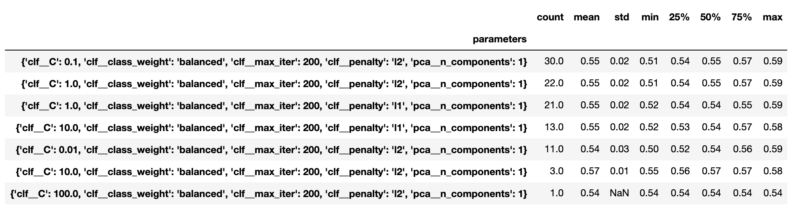

**B. Precision scores:**
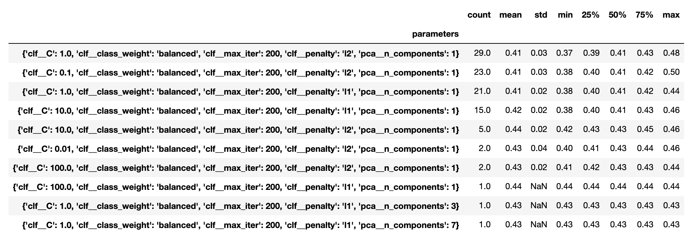

**C. Recall scores:**
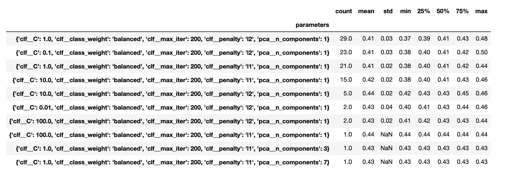

**2. SVM trained with upsampled minority class**

These are the top sets of hyperparameters, ranked by the most frequently appearing set of hyperparameters that gave the best F1, Precision, Recall scores during the grid search across 100 iterations of CV. 

**A. F1 scores:**
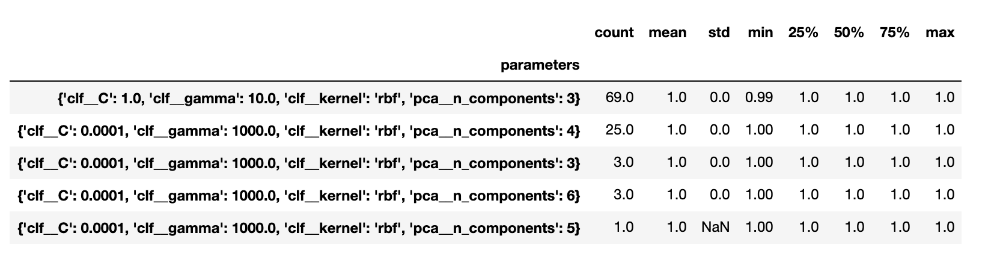

**B. Precision scores:**
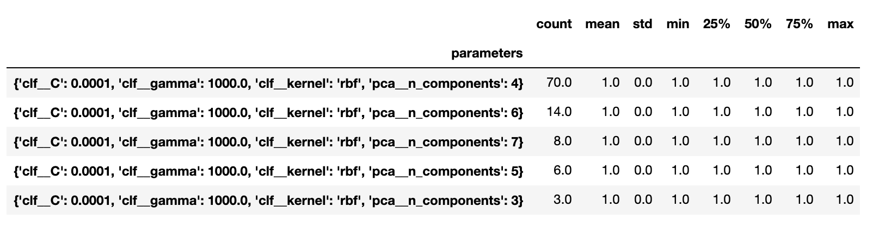

**C. Recall scores:**
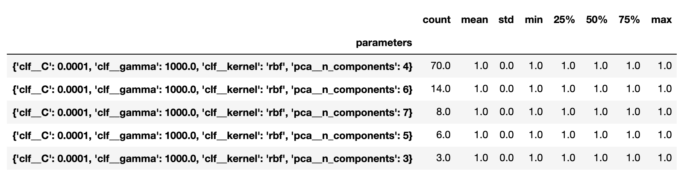

## (6) More performance evaluation (ROC and Precision-Recall Curves)

ROC and Precision-Recall curves were plotted for both Logistic regression trained with balanced class weight and SVM trained with balanced dataset through upsampling the minority class. These curves will allow decision to be made on the decision threshold of the classifier when used for future prediction via choosing the desired combination of TPR/FPR or Precision/Recall scores.

**1. Logistic regression with balanced class weight**

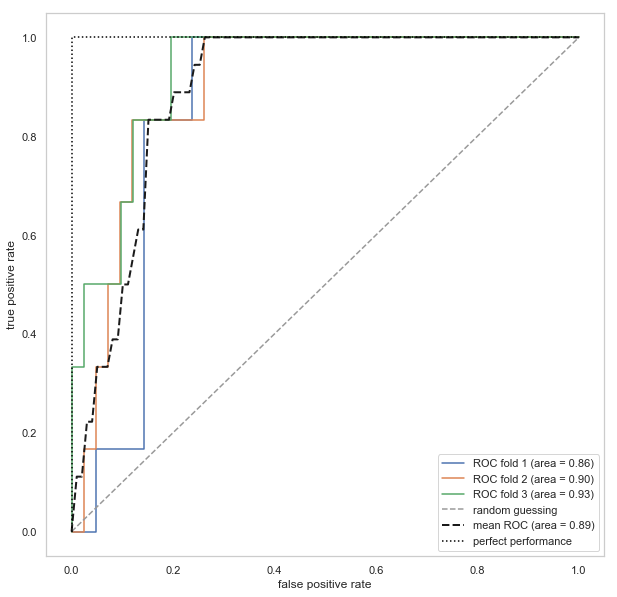
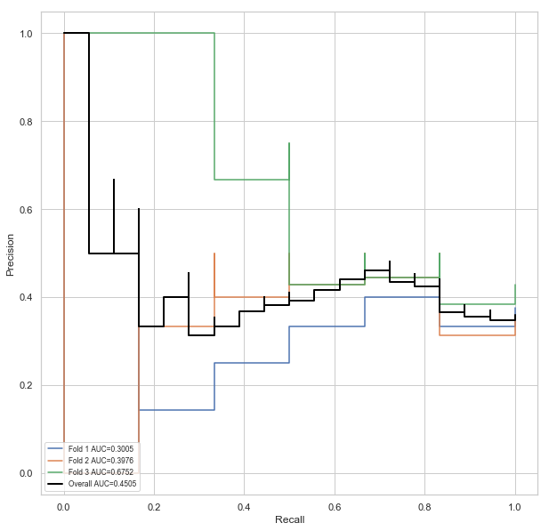

**2. SVM with upsampled minority class**

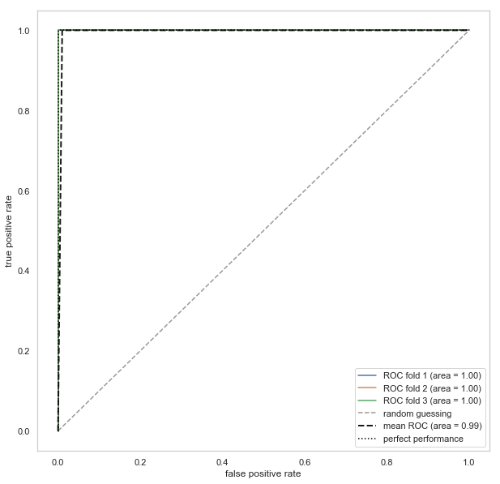
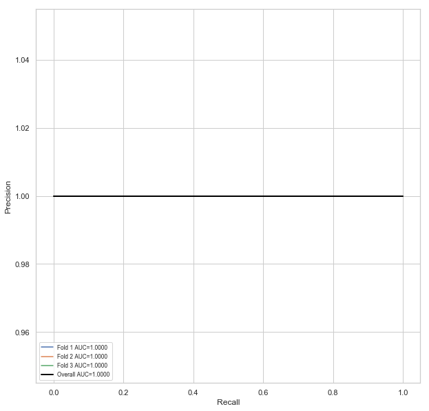

The SVM classifier built by training with a balanced dataset generated by upsampling the minority class is a perfect classifier. However, this method to upsample the minority class should be used with caution [Read here for more discussion on this](https://towardsdatascience.com/handling-imbalanced-datasets-in-machine-learning-7a0e84220f28) and this classifier should be further tested on a separate naive dataset for further evaluation. Nevertheless, this points towards the limitation of the given dataset i.e. low sample size with severe imbalance in the classes. This suggest the need to collect more data, especially in terms of the number of persons of interest. 

## References
* [Udacity UD120 Course](https://github.com/udacity/ud120-projects) 
* [Python Machine Learning by Sebasitan Raschka](https://sebastianraschka.com/books.html)
* [Scikit-learn](http://scikit-learn.org/)
